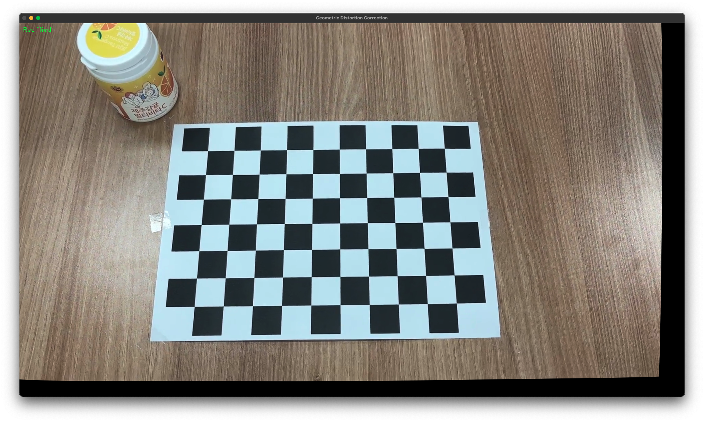

# Chessboard distortion correction
### 체스보드를 찍는 카메라를 캘리브레이션해서 이미지의 왜곡을 바로잡아주는 프로그램

## 카메라 캘리브레이션 결과
* The number of selected images = 42
* RMS error = 0.567463
* Camera matrix (K) = [
    [1735.925 0.000 993.063]
    [0.000 1735.934 573.203]
    [0.000 0.000 1.000]
]
* Distortion coefficient (k1, k2, p1, p2, k3) = 0.251413, -1.188235, 0.009189, 0.011738, 1.854149

## 렌즈 왜곡 보정 결과 데모
`Original`  

`Corrected`
